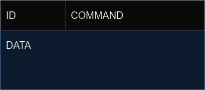

# Node-Oriented Farming System Protocol (NOFSP)
_version 1.0_

This document describes the protocol for data communication between nodes in a distributed application for farming
environments, called the Node-Oriented Farming System Protocol (NOFSP). The protocol provides modularity and flexibility,
and a combination of speed and reliability to any system implementing it. NOFSP is best suited for distributed
farming environments with high frequency transmission of sensor data.

## Terminology

* __system__ - one or more clients connected to a central server
* __client__ - an application program that can actively connect to a server
* __server__ - an application program that can establish connections for incoming clients
* __field node__ - a computer which has direct access to a set of sensors, a set of
    actuators and is connected to the Internet.
* __sensor__ - a device which senses the environment and describes it with a value (a double value in
  the context of this project). Examples: temperature sensor, humidity sensor.
* __actuator__ - a device which can influence the environment. Examples: a fan, a window opener/closer,
  door opener/closer, heater.
* __device class__ - a class that determines what kind of data a field node device understands.
* __field node system table (FNST)__ - data containing the addresses of every device connected to a field node, with every
address mapped to the respective device class
* __field node status map (FNSM)__ - data containing the addresses of every actuator connected to a field node, with every
state for each actuator being mapped to the respective address
* __field node pool__ - data containing the addresses, FNST, FNSM and name for every active field node in a system
* __active device__ - a device connected to a field node, that is or can be used by another client
* __active device list (ADL)__ - data containing the addresses of every active device for a field node
* __control panel__ - an application connected to the Internet that visualizes information about field nodes, such as
captured sensor data or the status of an actuator. The control panel is able to control actuators as well.
* __compatibility list__ - data containing all device classes that a control panel is able to understand
* __network node routing table__ - data containing the destination nodes for data received by each field node
* __channel__ - a logical channel for communication between a client and a server

## The underlying transport protocol

As NOFSP is an application layer protocol, it needs to receive service from transport layer protocols. This section
describes how this works in the protocol, and why the approach is desirable.

### Control data and sensor data

The data transmitted in a system implementing NOFSP can be divided into two categories: __control data__ and
__sensor data__. Control data refers to any data used for control in the environment, like adding new sensor nodes
or activating actuators. Sensor data refers to any data captured by a sensor, like temperature or humidity.
Control data exchange is _bidirectional_, meaning the message exchange for this category consists of a 
request and a response. On the other hand, sensor data exchange is _unidirectional_, meaning it always consists of 
one part pushing data to another, and never receiving any response.

The reliability of control data is crucial for the system to work properly. Lost packets to any actuator could
eventually harm the farming environment and be expensive. The reliability of sensor data however, is not as important.
Some lost packets from a sensor will not impact the system in any significant way, as a new packet will
shortly arrive and cover this loss. It is important to note that this is only true for sensors collecting data
frequently, where the average data for a period is more significant than the individual measurements. This protocol
is not suited for systems using sensors that collect data where every individual packet is significant, at least not
the current version of the protocol. The sensor data transmission for any system implementing NOFSP consists of relatively
small packets, where the packets are transmitted frequently, in contrast to control data that only occurs in events
involving "control" of the system, and may carry bigger loads of data.

### Hybrid transport solution

Because of how data in NOFSP is split into two categories, which each has its own
requirements, a hybrid transport protocol solution is used: TCP is used for control data and UDP is used for 
sensor data. This approach can be viewed as having two logical channels for communication in NOFSP, one for TCP 
and one for UDP. The reasons for this approach is explained in the following two paragraphs.

#### TCP for Control Data

Control data requires a reliable way to be transmitted, which makes TCP a perfect fit. As mentioned earlier, loss
of packets containing control data can seriously harm the farming environment. TCP makes sure that any lost 
(including corrupt) packets will be retransmitted, resulting in no loss of packets. TCP also provide order
preservation, which can also be crucial for transmission of control data.

#### UDP for Sensor Data

Unlike control data, which necessitates a reliable way of transmitting data, sensor data prioritizes 
efficiency and speed, which makes UDP the best fit. UDP does not require resources nor time for mechanisms
such as error correction (retransmission of packets), connection establishment and order preservation. Instead,
packets are sent in a fast and efficient way, not needing to care about lost packets. Another benefit UDP provides,
it that the headers are much smaller to that of TCP. This makes the overhead in the network smaller, 
which can significantly reduce traffic when small amounts of data are transmitted frequently.

One drawback worth considering for this approach is that UDP per se does not provide any means of congestion control.
This might or might not be a problem for the system implementing the protocol, and might require a custom solution.
The concept of [active device lists (ADL)](#active-device-list-adl) help reduce network traffic to a great extent, although it is not recognized 
as a congestion control mechanisms, as it cannot detect congestion. 

### Port numbers

Any client application implementing NOFSP can use any not well-known port, but it is recommended to use an ephemeral
(private) port to avoid possible collisions with registered ports.

As server applications implementing NOFSP will need to run two services; one TCP service for control data, and one 
UDP service for sensor-data, two different port numbers needs to be established as a result.
The server listens for __control data__ on port __60 005__ (_Control Service_), and listens for __sensor data__ 
messages on port __60 006__ (_Sensor Data Collection Service_).

## The architecture

The architecture of NOFSP provides modularity and scalability, and is designed in such a way that adding new 
nodes to a system is as seamless as possible, allowing for easily manageable systems. 

The following section describes the entities in the protocol, the roles of each entity as well as their 
relationship to each other. It also describes several key concepts for each entity, using defined data structures. 
It is important to note that these are not rules for implementation, and that they are rather 
explanations and justifications for the many concepts involved in NOFSP. Precise formats, data types, constants and
marshalling is described [later in the document](#types-constants).

### Entities

The entities in NOFSP at the highest level are __field nodes__, __control panels__ and the __central
server__. All of these three entities is referred to as __nodes__ in the network.
However, all three entities require different software implementations, as they have different responsibilities.
Together, they create a system for a farming environment that can capture sensor data, monitor the environment and
activate actuators, with minimal effort from the farmer.

#### Field nodes

A field node is an already established sub-system consisting of smaller devices: sensors and actuators. 
The protocol treats the field node as a single entity in the network, lets the node itself do the job of managing 
sensors and actuators. A field nodes is not constrained by the protocol in terms of either the quantity or the variety 
of sensors and actuators it accommodates. However, the field nodes itself needs to be aware of the sensors and actuators
it possesses.

The field node has two main jobs in NOFSP:
* __transmitting sensor data__: the field nodes is responsible for transmitting sensor data as soon as it is captured.
* __manage actuators__: as the field node has direct access to the actuators, it is responsible for controlling these
directly. It needs to be able to handle requests for actuator activation, and communicate any actuator state being
updated. 

A field node can both send and receive control data. Control data is used for registering the node, managing connections,
managing actuators and communicate information about its devices. A field node can only send sensor data.

##### Field Node Names

A field node is assigned a specific name, making it easier for the farmer to recognize the field node
in the system. This name must be a string and does not have to be unique. The given name for a field node
has no technical function to the system itself.

##### Field Node Device Classes

Even though the protocol does not interfere with how the field node manages its connected devices, a common language
is needed for the field node to communicate the devices it possesses to the rest of the system. Different devices
works with different types of data, and the rest of the system needs to be able to handle this. The solution is to 
classify these devices into __field node device classes__. These classes need to be agreed on globally in a system, 
meaning that every node in the system refers to the same kind of device for every device class.

The format for how to define such a class is given as _TYPE:CATEGORY_, without the semicolon, where the _type_ refers 
to the type of device, such as sensors and actuators, and the _category_ refers to the category of that type, such as 
humidity sensors or fan actuators. The type is either _S_ for sensors or _A_ for actuators, while the category is 
represented by a positive integer. A class for a temperature sensor could look like this: _S1_.

This approach for classifying field node devices allows for an easy addition of both new sensors and actuators,
as long as they are given a device class. It is important to know that the category only refers to the data 
transmitted, and not to the device itself. Two different devices can go under the same class, as long 
as they transmit/receive the same type of data. For sensors, the category determines what kind of data is sent and what
the data represents. Even though two sensors both send single double values of data, it can represent different
things, such as temperature and humidity, thus they would need to have different device classes.
For actuators, the category determines all the states it can be in, and how it can be put in those states. 

Even though device classes needs to be agreed on by all nodes in the system, that does not mean that
every node needs knowledge about all the device classes in the system. If a node does not have knowledge about a 
certain device class, it simply means that this node will not receive information for this class of devices, while
the rest of the system can still use it.

The table below illustrates the concept of field node device classes.

| Type     | Category (data format)                 | Class |
|----------|----------------------------------------|-------|
| sensor   | single temperature in celsius          | S1    |
| sensor   | block of humidity values in percentage | S7    |
| actuator | 1 or 0 for on or off                   | A2    |

##### Field Node System Table (FNST)

The __field node system table (FNST)__ is a table used for communicating the devices connected to a field node.
The purpose of this table is to store _address_ - _device class_ pairs for each device connected to a field node.
Once a field node has generated its FNST, it can then be used to communicate information about the devices the field
node possesses to other nodes in a system. All nodes that now has access to this table, can simply address the devices
of the field node by their addresses, and can look up the table to find the corresponding device address.

Each device is assigned a non-negative integer, and has to be unique for that field node.
FNST allows for multiple devices of the same device class, as long as they are assigned unique addresses.
The constraint of having only non-negative integer addresses is important, as it is necessary for [ADL updates](#adl-update).

| Class | Address |
|-------|---------|
| S7    | 1       |
| S1    | 2       |
| A5    | 3       |
| S7    | 4       |
| A2    | 5       | 

##### Active Device List (ADL)

The __active device list__ is (despite its name) a set that keeps track of which devices are active, 
indicated by their address in the set. Data should not be transmitted for devices that is not in this set. 
The sole purpose of ADL is to reduce traffic in the network by only pushing data that is actually used. The set is 
dynamic and can be updated using [ADL updates](#adl-update).

The following set illustrates the concept of an ADL.

    1, 4, 6, 3

#### Control panels

A __control panel__ is an entity in the network responsible for monitoring captured sensor data from field nodes, 
as well as to give the user control over the actuators. It can monitor only some of the field nodes in the network,
or all of them. The entity can both send and receive control data. Control data is used for registration, connection
management, subscribing to field nodes and controlling actuators. The control panel can only receive sensor data.

##### Compatibility list

While the field node needs an FNST, the control panel needs a __compatibility list__.
Despite its name, the compatibility list is actually a _set_, as it does not contain duplicate elements nor does the
order matter. The purpose of the compatibility list is to store each device class the control panel supports.
In other words, the compatibility list tells what kind of data the control panel can handle. The use of the 
compatibility list allows for backward compatibility, meaning that an older version of a control panel may
interact with a newer version of a field node. The network will also not be flooded by data that the control panel
do not understand.

Like FNST, it is the job of the control panel to create its compatibility list. The following set
illustrates the concept of a compatibility list.

    S13, S6, A13, S2, S3, S5, A19, S1

##### FNST copies

For the control panel to be able to understand and address the different devices of a field node, it
needs to store a copy of the FNST for each field node it subscribes to. This way, they can communicate using only the
device addresses, and they will both know what device the other part is referring to.

#### Central Server

The __central server__ is an entity in the network responsible for routing all messages, acting as a central hub.
A system is not able to function without the central server.
All data sent from a field node to a control panel will go through this entity, and vice versa.
Only one central server is allowed for each system.

The field nodes and control panels do not directly know about each other, as they are both only aware of the central
server. It is the job of this central server to coordinate all communication that needs to happen between
the field nodes and control panels.

##### Field Node Pool

The central server needs to keep track of the field nodes connected to it, as well as essential data for each
field node. This data includes the NFST, FNSM and the assigned name for each field node, and is stored in what is
called the __field node pool__.

The benefit of the field node pool is decreased redundant data transmission, which also decreases network traffic.
Instead of the field node transmitting its state for every request from a control panel, which might be exactly the
same transmitted to the previous control panel, this job is delegated to the central server. The field node simply
lets the central server know about its state and events, and the central server stores this information in its field
node pool. The central server can then forward this information to the appropriate control panels. In the case of 
a [field node pool pull](#field-node-pool-pull) request from a control panel, the central server simply sends
what information it got available. There is no need to involve a field node in such an event.

##### Network Node Routing Table (NNRT)

The central server introduces a new table to the protocol: the __network node routing table__. This table
describes the relation between field nodes and control panels in the system. Each field node is assigned with such a table to
keep track of their _subscribers_, which can be any number of control panels. It is important to note that this table is created,
stored and managed by the central server, and not the field node itself. The field node is not aware it its subscribers,
and does only focus on collecting and pushing data.

NNRT maps each field node to a number of control panels in the system. The table also includes the compatibility
list for each control panel. When an incoming packet is received from a field node, the central server checks the
table and only forwards the packet to the appropriate control panels. If a received datagram at the central server
contains sensor data, the source device is checked against the compatibility list. Only if the control panel supports 
the data (device class is in compatibility list), will the datagram will be forwarded.

| Control Panel | Compatibility list |
|---------------|--------------------|
| 1             | S1, A4, A6         |
| 2             | S1, S2, A4, A8     |

##### Field Node Status Map (FNSM)

The __field node status map__ stores the state for each actuator for a field node.
Instead of having the central server request the actuator state every time it needs this information, it simply keeps
a map containing this data. It is the responsibility of the field node to notify the central server in case of a 
status change, such that the central server can update its map accordingly. This mechanism saves a lot of
unnecessary network traffic. The following table shows an example of how such a map for a field node could look like.

| Actuator | Status code |
|----------|-------------|
| 1        | 4           |
| 2        | 0           |
| 3        | 1           |

The status of an actuator is not universal for all actuators, as different actuators might allow for different states.
The status code is to be interpreted by a control panel in combination with the class for the actuator, and together
make a more meaningful status description for the actuator.

### Client/server paradigm

The general architecture of a NOFSP system follows the client/server paradigm. Both the field nodes and control panels
act as clients, while the central server acts as a server. This means that it is always the field nodes and control
panels initiating connections, while the central server is always listening for incoming connections.
The field nodes and control panels will however need to run different client applications, as they are responsible
for different tasks.

Both the two clients and the server runs two different processes for communication, due to data in NOFSP being
divided into two different categories. These are not two independent services but rather one service
divided into two sub-services. The system as a whole relies on both to operate properly. The two processes
are called the __control process__ and the __data process__.

The __control process__ is used for transmission of control data. This process runs on TCP and can both send and
receive messages for all the three entities.

The __data process__ is used for transmission of sensor data. This process runs on UDP and can only send messages
for the field nodes, only receive messages for the control panels, while being able to both send and receive
messages for the central server.

### Node Addressing

As NOFSP allows for both many field nodes and control panel nodes, there is a need for addressing these nodes.
This is done giving every client connecting to the server the smallest available positive integer. The central server
needs to keep track of all connected clients, and be able to find the smallest available integer for any new client
connecting. 

The following table illustrates the concept of node addressing.

| Node          | Address |
|---------------|---------|
| field node    | 1       |
| field node    | 2       |
| control panel | 3       |
| control panel | 4       |
| field node    | 6       |

This example shows the node address table for a central server connected to five different clients. The system
had at one time at least 6 connected clients, since there is a gap in the addresses. Even if client number five left,
client number 6 still keeps its address. If a new client connects at this time, it will be assigned address five, since
it is the smallest available positive integer.

## The flow of information and events

When discussing flow of information and events in NOFSP, it is crucial to remember that messages are transmitted
through two different channels: one for control messages and one for sensor data messages. The following section 
describes how messages are exchanged in each event in NOFSP, and the nodes and process involved.

### Asymmetric encryption initialization

_Process_: __control process__

_Requester_: __any client__

_Responder_: __central server__

Asymmetric encryption initialization is the initial step of establishing a secure way of exchanging control messages.

1. __Initial request__: The client sends a request to the central server, asking for its asymmetric public key.
2. __Server responds__: The server generates a public key. If the key generation is successful, the server responds
with the generated key, and then sets its control message decryption strategy to use its asymmetric private key.
If the key generation fails, the server will respond with an error message indicating the failure.
3. __Client handles response__: If the client receives a response indicating a successful request, the client
will set its encryption strategy to use the public key provided in the response. If it receives an error message,
the client will continue using the previous encryption strategy.

### Symmetric encryption initialization

_Process_: __control process__

_Requester_: __any client__

_Responder_: __central server__

Symmetric encryption initialization is the second step of establishing a secure way of exchanging control messages.
The event requires that a successful asymmetric encryption initialization has already occurred.

1. __Initial request__: The client generates a secret key, and sends a request to the central server, asking it
to set its encryption and decryption strategy using the secret key provided.
2. __Server responds__: Once the central server receives the request, it checks if the message was encrypted.
If it was, the central server responds with a confirmation that the request was successful, and then proceeds to set
its encryption and decryption strategy to use the provided secret key. If the message was not encrypted, the central
server identifies this risk and responds with an error message indicating that the request was unsecure.
3. __Client handles response__: If the client receives a response indicating a successful request, the client will
set its encryption and decryption strategy to use the secret key. If it receives an error message, the client will
continue using the previous encryption and decryption strategy.

### Field node registration

_Process_: __control process__

_Requester_: __field node__

_Responder_: __central server__

Field node registration involves a field node registering itself at the central server. This phase is done for
every field node that wants to connect to the system, everytime. Since field nodes and control panels are registered
differently, the events are explained separately.

1. __Initial request__: The field node sends an initial request to register at the central server. This request contains
the field nodes FNST, FNSM and name.
2. __Server responds__: Once the central server receives the request, it stores the provided information about the 
field node and generates an address for the field node. If this happens successfully, a confirmation response is 
sent back to the field node, containing the assigned address. If the registration fails, an error message is sent
back, indicating the failure.
3. __Field node handles response__: If the field node receives a response indicating a successful registration,
it saves the provided address for further use. If it receives an error message, the error description 
is presented to the user.

### Control panel registration

_Process_: __control process__

_Requester_: __control panel__

_Responder_: __central server__

Control panel registration involves a control panel registering itself at the central server. This phase is somewhat
similar to a field node registration.

1. __Initial request__: The control panel sends an initial request ot register at the central server. This request contains
the compatibility list for the control panel.
2. __Server responds__: Once the central server receives the request, it stores the provided compatibility list and generates
an address for the control panel. If this happens successfully, a confirmation response is sent back the control panel,
containing the assigned address. If the registration fails, an error message is sent back, indicating the error.
3. __Control panel handles response__: If the control panel receives a response indicating a successful registration,
it saves the provided address for further use. If it receives an error message, the error description is presented to
the user.

### Heartbeats

_Process_: __control process__

_Requester_: __central server__

_Responder_: __any client__

Heartbeats is a mechanism used for maintaining TCP connections. Once a client has been registered at a central server,
the server sends out "heartbeats" every 15 seconds. A heartbeat is a small packet meant as a request for a response
if the client is still alive. If no response is given to a heartbeat within 15 seconds, the TCP connection will
be closed.

1. __Heart beats__: A small TCP packet is sent out to the client, requesting a response whether the client is alive
or not.
2. __Acknowledgement__: If a client receives the heartbeat, it will respond with an acknowledgement, and the timer
will be reset. If the client for some reason does not acknowledge the heartbeat, the connection will be closed.

### Field node pool pull

_Process_: __control process__

_Requester_: __control panel__

_Responder_: __central server__

A field node pool pull happens when a control panel wants to know about all the field nodes in the network.
This is done when a control panel wants to choose which field nodes it wants to "connect" to.

1. __Initial request__: The control panel client sends a request asking for the field node pool of the central server.
2. __Server responds__: Once the central server receives the request, it retrieves its field node pool and sends 
it back to the control panel.

### Subscribing to a field node

_Process_: __control process__

_Requester_: __control panel__

_Responder_: __central server__

Since the control panels never actually directly connects to any field node, using the term "connecting" is somewhat
misleading. The event is instead referred to as _subscribing_. When a control panel subscribes to a field node,
it tells the central server that it wants to receive all sensor data for that particular field node, and be able
to control its actuators.

1. __Initial__: The control panel client sends a request for subscribing to a specific field node.
This is done by sending a request containing the address of the given field node.
2. __Server responds__: In the case of a successful subscription, the server responds with a confirmation 
containing the field nodes FNST, FNSM and name. The NNRT for the field node will be updated and
any field node sensor data will now be forwarded to the control panel. This will also trigger an ADL update.
In case of a failed subscription request, the server responds with an error message.
3. __Control panel handles response__: If the control panel receives a response indicating a successful subscription,
it stores the provided data and can now [receive sensor data](#sensor-data-push) from the field node and 
[activate its actuators](#actuator-activation-control-panel-to-central-server).

### ADL update

_Process_: __control process__

_Requester_: __central server__

_Responder_: __field node__

Once a control panel subscribes to a field node, the central server will check the compatibility between the two.
It will then compare the extracted field node device classes with the NNRT for the field node, to check if any
new classes are introduced. If so, the server will tell the field node to update its ADL accordingly.
The same thing happens when a control panel unsubscribes from a field node: if any class is left unused, the server
will tell the field node to update its ADL accordingly.

1. __Initial request__: The server sends a request to the field node containing relevant ADL update data.
2. __Field node responds__: The field node responds with a confirmation if the update was successful.
In the case of a failed update, the field node responds with an error message.

### Sensor data push

_Process_: __sensor data process__

_Requester_: __field node__

_Responder_: __none__

Once a field node has established a control connection to a central server, it can start pushing sensor data using
the data process (UDP). It will only push data from sensors that can be found in the ADL, making it crucial to keep
the ADL for the field node up to date. This event includes the pushing of data in two iterations: first from the field
node to the central server, then from the central server to the subscribed control panels. This is always the case,
as the mechanisms of ADL prevents the field node from pushing any data when no control panel is subscribed.

1. __Data pushing__: Whenever the field node captures any data from one of its sensors, it checks its ADL whether this 
sensor data is used by the network. If so, it pushes the data to the central server using the data process.
2. __Data routing__: The central server only checks the header of the sensor data message, not the actual data.
The header is used for further routing of the data. If the message does not have any receivers, it is discarded and
an ADL event is triggered. No response is given back.

    If the message has one or more receivers, it is routed to the appropriate control panels. This is done by the 
    central server pushing a copy of the message to each subscribed control panel.

### Actuator status push

_Process_: __control process__

_Requester_: __field node__

_Responder_: __central server__

When the state of an actuator on a field node changes, it needs to communicate this change to the rest of the network.
This event is referred to as an __actuator status push__, and is done by first requesting to update this data at the
central server.

1. __Initial request__: When a field node registers a change of state for an actuator, it sends a request
to the central server notifying this change. This request contains the address of the actuator and its new state.
2. __Server responds__: Once receiving the request from a field node, the central server tries to update its 
FNSM accordingly. If it does so successfully, a confirmation response indicating the success is sent back,
and an [actuator status forwarding](#actuator-status-forwarding) event is triggered. If the update fails, an
error message is sent back to the field node, indicating the failed update.

### Actuator status forwarding

_Process_: __control process__

_Requester_: __central server__

_Responder_: __control panel__

When a central server updates its FNSM, it needs to communicate this change to all already subscribed control panels.
This event is referred to as an __actuator status forwarding__, and is done using the NNRT for the field node that
owns the actuator.

1. __Initial Request__: The central server sends a request to all subscribed control panels for a field node,
asking them to update their FNSM for the field node accordingly.
2. __Control panel responds:__ When the control panel receives a request for updating its implementation of the
field node actuator status, it responds with a confirmation of the request. If the update is failed,
the response will be an error message.

### Actuator activation (control panel to central server)

_Process_: __control process__

_Requester_: __control panel__

_Responder_: __central server__

An actuator activation (control panel to central server) event occurs when a control panel wants to activate a 
certain actuator for a field node. Since the control panel does not have a direct way to communicate with a field node, 
this request needs to go through the central server.

1. __Initial request__: The control panel sends a request to activate an actuator to the central server,
containing the address of the field node and the actuator.
2. __Central server responds__: When receiving the activation request, the central server needs to send an activation
request to the given field node. If the request is successfully forwarded to the appropriate field node, the
server will respond with a confirmation response indicating the successful event. In the case where the field node
cannot be reached, an error message is sent back, indicating the failure of the event.

### Actuator activation (central server to field node)

_Process_: __control process__

_Requester_: __central server__

_Responder_: __field node__

An actuator activation (central server to field node) event occurs when the central server wants to activate a
certain actuator for a field node.

1. __Initial request__:  The central server sends a request to activate an actuator to the field node, containing
the address of the actuator.
2. __Field node responds__: When receiving an activation request, the field node needs to activate the addressed
actuator. If the field node successfully activates its actuator, a confirmation message is sent back to the central
server as a response. If for some reason an error occurs during this event, the field node will respond with an
error message.

### Unsubscribing from a field node

_Process_: __control process__

_Requester_: __control panel__

_Responder_: __central server__

A control panel unsubscribing to a field node can happen in two ways:
* __actively unsubscribing__: the control panel actively unsubscribes from a field node. In this case, the control
panel first needs to notify the central server about this event, so that the central server can handle the unsubscribing.
* __connection closed__: in the case of closure of a control connection to a control panel, the control panel will
automatically be unsubscribed by the central server. This happens either if the control panel disconnects, or if the
heartbeat mechanism discovers a dead connection. This case does not involve any data communication in the network other
than triggering an ADL for the field node, as it is processed internally at the central server.

1. __Initial request__: A request is sent from the control panel to the central server, 
containing the address of the desired field node to unsubscribe from.
2. __Central server responds__: If the control panel is successfully unsubscribed, the central server updates its NNRT 
for the given field node accordingly, triggers an ADL update for the field node, and a confirmation message is sent as 
a response to the control panel. In case of an error, an error message is sent back to the control panel.

### Disconnecting

_Process_: __control process__

_Requester_: __any node__

_Responder_: __central server__

Any node, both field nodes and control panels, can disconnect from the system. This event includes closure of the
control process connection and triggering of some other events. The goal of a proper disconnection is to let all 
parties serving the node know of the event. 

There are two ways for a disconnection to occur. A __passive disconnection__ occurs when
the connection to a node is forced to be closed by the heartbeat mechanism. An __active disconnection__ occurs
when a node sends a request to the central server for disconnecting. Only an active disconnection will trigger this 
event, because it makes no sense to try to communicate with a node that cannot be reached.

1. __Initial request__: The node sends a request for disconnecting from the system to the central server.
2. __Server responds__: Once the server receives the request, it handles the disconnection and sends back
a confirmation indicating that the client can now disconnect.

## Connection and state

NOFSP is a connection-oriented protocol because all communication in the network relies on established TCP control
connections. Even though a "connection-less" sub-protocol for sensor data built on UDP is used, using this sub-protocol
does not work without an established TCP connection. Any entity that wants to use the NOFSP, will have to both start
and end their interaction with the system using the TCP control connection.

The protocol is also stateful, and this is a key reason to why it all works. First of all, only registered clients
are allowed to use the services of the protocol. The server stores successfully registered clients and assigns them
an address. Non-registered users are not able to interact with the server at all, except for registering.
Secondly, the server stores states for each client, like the field nodes a control panel subscribes to, or the status
for the actuators of a field node. Clients do not need to tell the server everything every time, the server
"remembers" the state of the clients. This significantly reduces the amount of traffic in the network, and can
help reduce congestion and hence data loss, which is crucial when dealing with non-reliable transport protocols
like UDP.

## Types, constants

NOFSP uses several data types and constants for communication. All data types and constants are described in the following
sections.

### Data types
 
The following list describes all data types used in the protocol, the encoding used for the data and the type-field bytes.

* __Integer__:
  * _Description_: Used to represent numerical data that does not require decimal points.
  * _Encoding_: standard 34-bit format
  * _Type-field bytes_: 0000 0000 0000 0000
* __Double__:
  * _Description_: Used to represent numerical data that does require numerical points.
  * _Encoding_: IEEE 754 floating-point standard
  * _Type-field bytes_: 0000 0000 0000 0011
* __String__:
  * _Description_: Used to represent textual data.
  * _Encoding_: UTF-8 format
  * _Type-field bytes_: 0000 0000 0000 0001
* __Null__:
  * _Description_: Used to represent the absence of data.
  * _Encoding_: 0 bytes provided - no encoding
  * _Type-field bytes_: 0000 0000 0000 0100
* __Public key__:
  * _Description_: Used to represent the public key for asymmetric encryption.
  * _Encoding_: X.509
  * _Type-field bytes_: 0000 0000 0000 0101
* __Secret key__: 
  * _Description_: Used to represent the secret key for symmetric encryption.
  * _Encoding_: PKCS#8
  * _Type-field bytes_: 0000 0000 0000 0110
* __Set__:
  * _Description_: Used to represent a collection of unique elements, where order does not matter.
  * _Encoding_: A series of TLVs of the same data type. The order does not matter as it is not preserved.
  * _Type-field bytes_: 0000 0000 0000 1010
* __List__:
  * _Description_: Used to represent a collection elements, where order matters.
  * _Encoding_: A series of TLVs of the same data type. The order matters as it is preserved.
  * _Type-field bytes_: 0000 0000 0000 1011
* __Map__:
  * _Description_: Used to represent a collection of key-value pairs.
  * _Encoding_: A series of TLVs where every odd-number and even-number TLV are of the same data type, respectively.
  * _Type-field bytes_: 0000 0000 0000 1100

### Constants

Control messages sent in NOFSP need to carry either a __command__ for request messages, or a __status code__ for 
response messages. Since there are only one type of sensor data messages, there is no need to define any constants for 
this type.

#### Requests

Requests always carries a command, often together with parameters. The list below shows all available commands for the
protocol.

| Command | Parameters                                             | Description                                                                                                                                                                                                                                                                                                                                                      |
|---------|--------------------------------------------------------|------------------------------------------------------------------------------------------------------------------------------------------------------------------------------------------------------------------------------------------------------------------------------------------------------------------------------------------------------------------|
| REGFN   | _FNST_, _name_                                         | Registering a field node to a central server. The command takes two parameters: the FNST and the name of the field node. The FNST is a map of integers mapped to maps of integers mapped to strings. The name is a string.                                                                                                                                       |
| REGCP   | _compatibility list_                                   | Registering a control panel to a central server. The command takes one parameter: the compatibility list of the control panel. The compatibility list is a list of strings.                                                                                                                                                                                      |
| HBEAT   |                                                        | Checks whether a client is still alive. The command takes no parameters.                                                                                                                                                                                                                                                                                         |
| PPULL   |                                                        | A control panel requests to receive the field pool: information about all the field nodes in the network. The command takes no parameters.                                                                                                                                                                                                                       |
| FNSUB   | _field node address_                                   | A control panel requests to subscribe to a field node. The command takes one parameter: the address for the given field node. The field node address is an integer.                                                                                                                                                                                              |
| ADLUPD  | _ADL data_                                             | The central server requests for a ADL update at a field node. The command takes one parameter: the ADL data to update. The ADL data is a list of integers.                                                                                                                                                                                                       |
| ACTNOT  | _actuator address_, _new status_                       | An field node requests for an FNSM update at the central server, notifying that an actuator has changed its state. The command takes two arguments: the actuator address incidating the address of the actuator, and the new status for the actuator. Both parameters are integers.                                                                              |
| FNSMNOT | _field node address_, _actuator address_, _new status_ | The central server requests for an update of the status for an actuator at the control panel. The command takes three parameters: the field node address indicating the address of the field node, the actuator address indicating the address of the actuator, and the new status indicating the new status of the actuator. All three parameters are integers. |
| ACTACT  | _field node address_, _actuator address_, _new status_ | The control panel requests for an activation of an actuator at a given field node. The command takes three parameters: the field node address indicating the address for the field node, the actuator address indicating the address for the actuator, and the desired new status for the actuator. All three parameters are integers.                           |
| ACTACT  | _actuator address_, _new status_                       | The central server requests for an activation of an actuator at a given field node. The command takes two parameters: the actuator address indicating the address of the actuator, and the desired new status for the actuator. Both parameters are integers.                                                                                                    |
| FNUNSUB | _field node address_                                   | The control panel requests to unsubscribe from a given field node. The command takes one parameter: the field node address indicating the address for the field node. The field nodes address is an integer.                                                                                                                                                     |
| DISC    |                                                        | A field node or a control panel requests to disconnect from the central server. The command takes no parameters.                                                                                                                                                                                                                                                 |
| ASYM    | _public key_                                           | A client requests the public key of the central server. The public key is of public key data type.                                                                                                                                                                                                                                                               |
| SYM     | _secret key_                                           | A client requests the central server to start encrypting/decryption messages with the provided secret key. The secret key is of secret key data type.                                                                                                                                                                                                            |

#### Responses

Responses always carries a status code, indicating the status of execution of a previously sent request. Some responses
also has additional parameters, depending on the type of status code. The status code domain is divided into two main
groups:
* __0 - 99__: Successful requests
* __100 - 199__: Errors

The table below shows all __response messages indicating successful requests__ for the protocol.

| Status code | Parameters             | Description                                                                                                                                                                                                                                                                                            |
|-------------|------------------------|--------------------------------------------------------------------------------------------------------------------------------------------------------------------------------------------------------------------------------------------------------------------------------------------------------|
| 0           |                        | Heartbeat response - the client confirms it is still alive.                                                                                                                                                                                                                                            |
| 1           | _node/client address_  | The central server confirms a node/client registration and responds with their assigned address for the network. The node/client address is an integer.                                                                                                                                                |
| 2           | _fnst_, _fnsm_, _name_ | The central server confirms the subscription of a field node for a control panel. The response contains all information needed for the control panel. The FNST is a map mapping integers to maps mapping integers to strings, the FNSM is a map mapping integers to strings, and the name is a string. |
| 3           | _field node address_   | The central server confirms the cancelled subscription of a field node for a control panel. The response contains the address of the field node. The field node address is an integer.                                                                                                                 |
| 10          | _field node pool_      | The central server responds to a field node pool pull request, confirming that the request was successfully handled, sending the field node pool with it. The field node pool is a map mapping integers to strings (the name of the field nodes).                                                      |
| 20          | _updated adl_          | The field node responds to an ADL update response, providing the updated ADL. The updated ADL is a set of integers.                                                                                                                                                                                    |
| 25          |                        | The central server confirms that its FNSM for a field node has been updated.                                                                                                                                                                                                                           |
| 27          |                        | The control panel confirms that it has received and processed the change of state for an actuator.                                                                                                                                                                                                     |
| 30          |                        | Either the field node or the central server confirms that an actuator activation request was successful, depending on the requestor.                                                                                                                                                                   |
| 50          |                        | The central server confirms that a client is allowed to disconnect.                                                                                                                                                                                                                                    |
| 60          | _public key_           | The central responds with a public key to be used for message encryption. The public key is of public key data type.                                                                                                                                                                                   |
| 61          | _secret key_           | The central server responds with the secret key to be used for symmetric encryption. The secret key is of secret key data type.                                                                                                                                                                        |                                                                                                                                                                                                                                                           

The table below shows all __error messages__ for the protocol. All error messages have only one parameter, the __error description__, which is a string TLV describing the cause
of the error.

| Status code | Description                                                                                                                                                                     |
|-------------|---------------------------------------------------------------------------------------------------------------------------------------------------------------------------------|
| 100         | The central server responds with this error message when a request is received from a client that is not authenticated (not yet registered). The error description is a string. |
| 101         | The central server responds with this error message when it is unable to register a client. The error description is a string.                                                  |
| 102         | The central server responds with this error message when a subscription of a field node fails. The error description is a string.                                               |
| 103         | The field node indicates that the ADL update failed.                                                                                                                            |
| 104         | The central server indicates the FNSM for a field node failed to update.                                                                                                        |
| 105         | The control panel indicates that no virtual device for a given address exists.                                                                                                  |
| 106         | The central server indicates that a given field node cannot be reached.                                                                                                         |
| 107         | The field node indicates that it could not interact with a given device.                                                                                                        |
| 110         | The central server indicates that a request is not secure.                                                                                                                      |
| 111         | Any node indicates that key generation has failed.                                                                                                                              |

## Message format

### Data marshalling

NOFSP uses _TLV (Type-Length-Value)_ marshalling for the serialization of its messages. This method is particularly
advantageous as it accommodates various message types, each requiring different space allocations. This marshalling
technique streamlines the classification of messages, ensuring that the integration of additional message types is
straightforward.

All data in the protocol (including [message frames](#message-frame)) uses a TLV structure with a type field and
length field of 2 bytes. This allows for a total of 65536 different TLV type fields, and data field up to a length
of 65536 bytes. TLVs are also used recursively, meaning that the value-field of a TLV can consist of other TLVs.

### Message frame

The message frame encapsulates all messages in the protocol. 
All messages sent in the protocol needs a message frame before
being sent over the network. The message frame serves the purpose of indicating what type of message it contains. 
The type of message frames are and their respective type field bytes are:

* __request message__: 0000 0001 0000 0000
* __response message__: 0000 0001 0000 0001
* __sensor data__: 0000 0010 0000 0000

These are the first bytes that will be received first for every message in the protocol (if you ignore TCP/UDP headers),
and helps indicate how the rest of the message should be interpreted.

### Control Message Format

Communication using control messages involves a request and a response. A request message is always sent first,
which is answered by a response. We therefore need to define two formats for these types of messages: one for
requests and one for responses. All control message fields are represented as TLVs.

#### Control Request

At a high level, a control request contains three fields described as follows:
* __message id__: the id of the request. This field is an integer TLV.
* __command__: the command field describes the command used for the request.
The command also indicates what kind of data is sent, and how it should be interpreted. This field is a string TLV.
* __data__: the data field acts as a field holding the parameters for the given command. 
This field is a container TLV (type-field does not matter), with a value-field
containing all the required parameter TLVs for the request. Required parameters for each request
can be found in the section describing [request constants](#requests).

#### Control Response

A control response contains three fields described as follows:

* __message id__: the id of the request. This field is an integer TLV.
* __status__: the status field describes the status of the response given to a request. This indicates how the request
was handled. The status also indicates what kind of data is sent, and how it should be interpreted. This field is an
integer TLV.
* __data__: the data acts as a field holding the parameters for the given status code. This field is a container TLV
  (type does not matter), with a value-field containing all the required parameter TLVs for the response. Required parameters
for each response can be found in the section describing [response constants](#responses).

### Sensor Data Message Format

Communication using sensor data messages involves only requests: all data for this type is pushed from one network
entity to another. There is never any direct response for these messages. Therefore, only one format for these
messages is defined.

* __node address__: the node address field gives the address for the field node that captured the data.
This field is an integer TLV.
* __device address__: the device address field gives the address for the field node device that captured the data.
This field is an integer TLV.
* __data__: the data field contains data captured by the sensor. This field is a TLV defined by the device class
of the sensor that captured it, and is not defined by the protocol.

#### Sensor data frame constraints

Since sensor data messages in NOFSP uses the services of UDP to send data, there are some constraints that need to be
set in order for the sensor data messages to use the same message frames. Due to the connection-less nature of UDP,
UDP lacks any packet retransmission mechanism, and the loss of a single fragment prevents the reassembly of the entire
datagram. This can cause a decrease in performance, and is therefore best avoided. NOFSP deals with this by setting
a constraint on the size of sensor data frame messages, limiting it to under 1500 bytes, which is the typical
Maximum Transmission Unit (MTU) on an Ethernet network. The size limit for a sensor data message is __1000__ bytes,
making space for IP, UDP and message frame headers, while leaving some room for future changes. Any sensor data bigger
message than this will not be accepted by the protocol.

## An example scenario

The following section describes an example scenario for a system implementing NOFSP. Specific details such as 
message formats are emitted, as they can be found other places in the document.

### Phase 1: Field node registration
1. A field node with the following devices initiates an active open to a central server:
   * A temperature sensor with address 1 and device class _S1_.
   * A humidity sensor with address 2 and device class _S2_.
   * An air conditioner actuator with address 3 and device class _A4_.

2. The field node wants a secure way of communicating with the central server, and therefore sends a request
  for the servers public key (_ASYM_ request). 
3. The server responds with its public key (_60_ response), and they both change
  their encryption/decryption strategies to asymmetric encryption.
4. The field node then generates a symmetric key for further communication and requests the central server to start
  using this secret key (_SYM_ request).
5. The central server accepts this secret key, and respond with a confirmation that the key was accepted (_61_ response).
  They both change their encryption/decryption strategies to symmetric encryption. 
6. The field node now registers at the central server. It sends a request to register (_REGFN_ request),
  containing its _FNST_, _FNSM_ and name.
7. The central server accepts the registration, and sends back a response indicating the success (_1_ response), and provides 
  it with address 0. 
 
### Phase 2: Control panel registration
1. A control panel with the following compatibility list initiates an active open to the same central server:
   * _S1_, _A4_.
2. The control panel wants a secure way of communicating with the central server, and therefore sends a request
   for the servers public key (_ASYM_ request).
3. The server responds with its public key (_60_ response), and they both change
   their encryption/decryption strategies to asymmetric encryption.
4. The control panel then generates a symmetric key for further communication and requests the central server to start
   using this secret key (_SYM_ request).
5. The central server accepts this secret key, and respond with a confirmation that the key was accepted (_61_ response).
   They both change their encryption/decryption strategies to symmetric encryption.
6. The control panel now registers at the central server. It sends a request to register (_REGCP_ request),
  containing its _compatibility list_.
7. The central server accepts the registration, and sends back a response indicating the success (_1_ response), and provides
  it with address 1.

### Phase 3: Sending sensor data
1. The control panel looks for sensor data to monitor, and therefore sends a request for the central servers field node pool
   (_PPULL_ request). 
2. The central server sends back its available field nodes with a response (_10_ response), which contains only one field node;
   field node 0 that registered in phase 1.
3. The control panel sends a request to subscribe to the provided field node (_FNSUB_ request).
4. The central server accepted the subscription and sends back a response containing information about the field node (_2_ response).
5. The central server generates an ADL update for the field node, based on the compatibility list of the control panel.
  It then sends a request to the field node asking it to update its ADL accordingly (_ADLUPD_ request).
6. The field node updates its ADL accordingly, and responds with a confirmation response to the central server (_20_ response).
7. The field node now sends captured sensor data only for sensor with address 1, as it is the only device class
   compatible for the control panel. It sends the sensor data message to the central server, and then the central
  server forwards this message to the control panel.

## Reliability and security
The protocol does not define any reliability mechanisms; it relies on the reliability of TCP for control messages,
and tolerates potential loss of sensor data messages to some degree. However, the [ADL](#active-device-list-adl)
mechanism does provide reduced network traffic to a pretty significant extent in large systems. Although this does not
guarantee reliability per se, it can definitely reduce the loss rate of sensor data packets.

Confidentiality is provided by message encryption. A client can establish symmetric key encryption with the central server
for control messages, making it virtually impossible for a man-in-the-middle attack. The symmetric key (secret key)
is communicated using asymmetric encryption: a client uses the servers public key to encrypt the message containing 
the symmetric key, and the server uses its private key to decrypt this message. It is worth noting that message integrity
is not guaranteed, as anyone could provide a client with a public key, which makes the protocol susceptible to spoofing.
