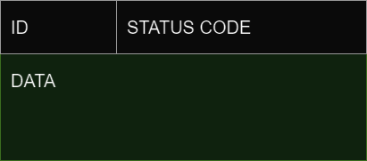
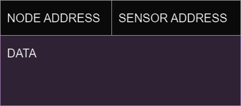

# Node-Oriented Farming System Protocol (NOFSP)
_version 1.0_

This document describes the protocol for data communication between nodes in a distributed application for farming
environments, called Node-Oriented Farming System Protocol (NOFSP). The protocol provides modularity and flexibility,
and a combination of speed and reliability to any system implementing it. NOFSP is best suited for distributed
farming environments transmitting sensor data continuously.

## Terminology

* __system__ - one or several clients connected to a central server
* __sensor__ - a device which senses the environment and describes it with a value (a double value in
  the context of this project). Examples: temperature sensor, humidity sensor.
* __actuator__ - a device which can influence the environment. Examples: a fan, a window opener/closer,
  door opener/closer, heater.
* __field node__ - a computer which has direct access to a set of sensors, a set of
  actuators and is connected to the Internet.
* __control panel__ node - a device connected to the Internet which visualizes status of sensor and
  actuator nodes and sends control commands to them.
* __field node system table__ - a table containing information about each sensor and actuator connected to a field
node, such as their type and address.
* __channel__ - a logical channel for communication between a client and a server
* Graphical User Interface (GUI) - A graphical interface where users of the system can interact with
  it.

## The underlying transport protocol

_TODO - what transport-layer protocol do you use? TCP? UDP? What port number(s)? Why did you 
choose this transport layer protocol?_

As NOFSP is an application layer protocol, it needs to receive service from transport layer protocols. This section
describes how this works in the protocol.

### Control data and sensor data

The data transmitted in a system implementing NOFSP can be divided into two categories: __control data__ and
__sensor data__. Control data refers to any data used for control in the environment, like adding new sensor nodes
or activating actuators. Sensor data refers to any data captured by a sensor, like temperature or humidity.
Control data exchange is _bidirectional_, meaning the message exchange for this category consists of a 
request and a response. On the other hand, sensor data exchange is _unidirectional_, meaning it always consists of 
one part pushing data to another, and never receiving any response.

The reliability of control data is crucial for the system to work properly. Lost packets to any actuator could
eventually harm the farming environment and be expensive. The reliability of sensor data however, is not as important.
Some lost packets from any continuous sensor will not impact the system in any significant way, as a new packet will
shortly arrive and cover this loss. It is important to note that this is only true for sensors collecting data
continuously, where the average data for a period is more significant than the individual measurements. This protocol
is not suited for systems using sensors that collect data where every individual packet is significant, at least not
the current version of the protocol. The sensor data transmission for any system implementing NOFSP consists of relatively
small packets, where the packets are transmitted frequently, in contrast to control data that only occurs in events
involving "control" of the system, and may carry bigger loads of data.

### Hybrid transport solution

Because of how data in NOFSP is split into two categories, which each has different
requirements, a hybrid transport protocol solution is used: TCP is used for control data and UDP is used for 
sensor data. This approach can be viewed as having two logical channels for communication in NOFSP, one for TCP 
and one for UDP. The reasons for this approach is explained in the following two paragraphs.

#### TCP for Control Data

Control data requires a reliable way to be transmitted, which makes TCP a perfect fit. As mentioned earlier, loss
of packets containing control data can seriously harm the farming environment. TCP makes sure that any lost 
(including corrupt) packets will be retransmitted, resulting in no loss of packets. TCP also provide order
preservation, which can also be crucial for transmission of control data.

#### UDP for Sensor Data

Unlike control data, which necessitates a reliable way of transmitting data, sensor data prioritizes 
efficiency and speed, which makes UDP the best fit. UDP does not require resources for not time for mechanisms
such as error handling (retransmission of packets), connection establishment and order preservation. Instead,
packets are sent in a fast and efficient way, not needing to care about lost packets. Another benefit UDP provides,
it that the headers are much smaller to that of TCP. This makes the overhead in the network smaller, 
which can significantly reduce traffic when small amounts of data are transmitted frequently.

One drawback worth considering for this approach is that UDP per se does not provide any means of congestion control.
This might or might not be a problem for the system implementing the protocol, and might require a custom solution.

### Port numbers

Any client application implementing NOFSP can use any not well-known port, but it is recommended to use an ephemeral
(private) port to avoid possible collisions with registered ports.

As server applications implementing NOFSP will need to run two services; one TCP service for control data, and one 
UDP service for sensor-data, two different port numbers needs to be established as a result.
The server listens for __control data__ on port __60 005__ (_Control Service_), and listens for __sensor data__ 
messages on port __60 006__ (_Sensor Data Collection Service_). However, before any connection has been established,
the client only needs to be aware of the control service port number. The server will communicate the port number
for the sensor data collection service in the registration phase, which is explained in detail later in the
document.

## The architecture

_TODO - show the general architecture of your network. Which part is a server? Who are clients? 
Do you have one or several servers? Perhaps include a picture here._

The architecture of NOFSP provides modularity and scalability, and is designed in such a way that adding new 
nodes to a system is as seamless as possible, allowing for easily manageable systems. 

The following section describes the entities in the protocol, the roles of each entity as well as their 
relationship to each other. It also describes several key concepts for each entity, using defined data structures. 
It is important to note that these are not rules for implementation, and that they are instead 
explanations and justifications for the many concepts involved in NOFSP. Precise formats, data types, constants and
marshalling is described later in the document.

### Entities

The entities in NOFSP at the highest level are __field nodes__, __control panels__ and the __central
server__. All of these three entities is referred to as __nodes__ in the network.
However, all three entities require different software implementations, as they have different responsibilities.
Together, they create a system for a farming environment that can capture sensor data, monitor the environment and
activate actuators, with minimal effort from the farmer.

#### Field nodes

A field node is an already established sub-system consisting of smaller devices: sensors and actuators. 
The protocol treats the field node as a single entity in the network, lets the node itself do the job of managing 
sensors and actuators. A field nodes is not constrained by the protocol in terms of either the quantity or the variety 
of sensors and actuators it accommodates. However, the field nodes itself needs to be aware of the sensors and actuators
it possesses.

The field node has two main jobs in NOFSP:
* __transmitting sensor data__: the field nodes is responsible for transmitting sensor data as soon as possible.
For transmitting sensor data, the field node is also responsible for communicating what kind of sensor data is being
sent, and what kind of sensors it possesses.
* __manage actuators__: the field node is responsible for handling actuator activation requests, and reporting back
changes in actuator states to the system. For this job, the field node is also responsible for communicating what kind
of actuators it possesses.

A field node can both send and receive control data. Control data is used for registering the node, managing connections,
managing actuators and communicate information about its devices. A field node can only send sensor data.

##### Field Node Names

A field node can optionally be assigned a specific name, making it easier for the farmer to recognize the field node
in the system. This name must be a string and does not have to be unique. The given name for a field node
has no technical function to the system itself.

##### Field Node Device Classes

Even though the protocol does not interfere with how the field node manages its connected devices, a common language
is needed for the field node to communicate the devices it possesses to the rest of the system. Each device will
send or handle data differently, and the system needs to know how to handle this. The solution is to classify these
devices into __field node device classes__. These classifications need to be agreed on globally in a system, 
meaning that every node in the system refers to the same kind of data communication technique, when referring to the
same class.

The format for how to define such a class is given as _TYPE:CATEGORY_, without the semicolon, where the _type_ refers 
to the type of device, such as sensors and actuators, and the _category_ refers to the category of that type, such as 
humidity sensors or fan actuators. The type is either _S_ for sensors or _A_ for actuators, while the category is 
represented by a positive integer. A class for a temperature sensor could look like this: _S1_.

This approach for classifying field node devices allows for the addition of both new sensors and actuators,
as long as they are given a new class. It is important to know that the category only refers to how data is transmitted,
not to the device itself. Two different devices can go under the same class, as long as they transmit/receive data
the same way. Even though device classes needs to be agreed on by all nodes in the system, that does not mean that
every node needs knowledge about all the device classes in the system. The table below demonstrates how these device
classes can be implemented.

| Type     | Category (data format)                 | Class |
|----------|----------------------------------------|-------|
| sensor   | single temperature in celsius          | S1    |
| sensor   | block of humidity values in percentage | S7    |
| actuator | 1 or 0 for on or off                   | A2    |

##### Field Node System Table (FNST)

The __field node system table (FNST)__ is a table used for communicating the devices connected to a field node.
The job of this table is to store _address_ - _device class_ pairs for each device connected to a field node.
Once a field node has generated its FNST, it can then be used to communicate information about the devices the field
node possesses to other nodes in a system. All nodes that now has access to this table, can simply address the devices
of the field node by their addresses, and can look up the table to find the corresponding device address.

Each device is assigned a non-negative integer, and has to be unique for that field node.
FNST allows for multiple devices of the same device class, as long as they are assigned unique addresses.

| Class | Address |
|-------|---------|
| S7    | 1       |
| S1    | 2       |
| A5    | 3       |
| S7    | 4       |
| A2    | 5       | 

##### Active Device List (ADL)

The __active device list__ is a list that keeps track of which devices are active.
Data should not be transmitted for devices that is not in this list. The sole purpose of ADL is to reduce traffic in 
the network by only pushing data that is actually used. Unlike FNST, which is communicated to other nodes, the ADL itself
is never transmitted in the network, and is stored only by the field node itself. However, to know when and how to update
the ADL, the field node needs [ADL update](#adl-update) messages from the central server.

#### Control panels

A __control panel__ is an entity in the network responsible for monitoring captured sensor data from field nodes, 
as well as to give the user control over the actuators. It can monitor only some of the field nodes in the network,
or all of them. The entity can both send and receive control data. Control data is used for registration, connection
management, subscribing to field nodes and controlling actuators. The control panel can only receive sensor data.

##### Compatibility list

While the field node needs to keep an FNST, the control panel needs to keep a __compatibility list__.
Despite its name, the compatibility list is actually a _set_, as it does not contain duplicate elements nor does the
order matter. The job of the compatibility list is to store each device class the control panel supports.
In other words, the compatibility list tells what kind of data the control panel can handle. The use of the 
compatibility list allows for backward compatibility, meaning that an older version of a control panel may
interact with a newer version of a field node. The network will in turn not be flooded by data that the control panel
do not understand.

Like FNST, it is the job of the control panel to create its compatibility list. The following list
shows an example of what a compatibility list could look like.

    S13, S6, A13, S2, S3, S5, A19, S1

##### FNST copies

For the control panel to be able to understand and address the different devices of a field node, it
needs to store a copy of the FNST for each field node it subscribes to. This way, they can communicate using only the
device addresses, and they will both know what device the other part is referring to.

#### Central Server

The __central server__ is an entity in the network responsible for routing all messages, acting as a central hub.
A system is not able to function without the central server.
All data sent from a field node to a control panel will go through this entity, and vice versa.
Only one central server is allowed for each system.

The field nodes and control panels do not directly know about each other, as they are both only aware of the central
server. It is the job of this central server to coordinate all communication that needs to happen between
the field nodes and control panels.

##### Field Node Pool

The central server needs to keep track of the field nodes connected to it, as well as essential data for each
field node. This data includes the NFST, FNSM and possibly the assigned name, and is stored in what is
called the __field node pool__.

The benefit of the field node pool is decreased redundant data transmission, which also decreases network traffic.
Instead of the field node transmitting its state for every request from a control panel, which might be exactly the
same transmitted to the previous control panel, this job is delegated to the central server. The field node simply
lets the central server know about its state and events, and the central server stores this information in its field
node pool. The central server can then forward this information to the appropriate control panels. In the case of 
a [field node pool pull](#field-node-pool-pull) request from a control panel, the central server simply sends
what information it got available. There is no need to involve a field node in such an event.

##### Network Node Routing Table (NNRT)

The central server introduces a new table to the protocol: the __network node routing table__. This table
describes the relation between field nodes and control panels in the system. Each field node is assigned with such a table to
keep track of their _subscribers_, which can be any number of control panels. It is important to note that this table is created,
stored and managed by the central server, and not the field node itself. The field node is not aware it its subscribers,
and does only focus on collecting and pushing data.

NNRT maps each field node to a number of control panels in the system. The table also includes the compatibility
list for each control panel. When an incoming packet is received from a field node, the central server checks the
table and only forwards the packet to the appropriate control panels. If a received datagram at the central server
contains sensor data, the source device is checked against the compatibility list. Only if the control panel supports 
the data (device class is in compatibility list), will the datagram will be forwarded.

| Control Panel | Compatibility list |
|---------------|--------------------|
| 1             | S1, A4, A6         |
| 2             | S1, S2, A4, A8     |

##### Field Node Status Map (FNSM)

The __field node status map__ stores data the actuator states for a given field node.
Instead of having the central server request the actuator state every time it needs this information, it simply keeps
a map containing this data. It is the responsibility of the field node to notify the central server in case of a 
status change, such that the central server can update its map accordingly. This mechanism saves a lot of
unnecessary network traffic. The following table shows an example of how such a map for a field node could look like.

| Actuator | Status code |
|----------|-------------|
| 1        | 4           |
| 2        | 0           |
| 3        | 1           |

The status of an actuator is not universal for all actuators, as different actuators might allow for different states.
The status code is to be interpreted by a control panel in combination with the class for the actuator, and together
make a more meaningful status description for the actuator.

### Client/server paradigm

The general architecture of a NOFSP system follows the client/server paradigm. Both the field nodes and control panels
act as clients, while the central server acts as a server. This means that it is always the field nodes and control
panels initiating connections, while the central server is always listening for incoming connections.
The field nodes and control panels will however need to run different client applications, as they are responsible
for different tasks.

Both the two clients and the server runs two different processes for communication, due to data in NOFSP being
divided into two different categories. These are not two independent services but rather one service
divided into two sub-services. The system as a whole relies on both to operate properly. The two processes
are called the __control process__ and the __data process__.

The __control process__ is used for transmission of control data. This process runs on TCP and can both send and
receive messages for all the three entities.

The __data process__ is used for transmission of sensor data. This process runs on UDP and can only send messages
for the field nodes, only receive messages for the control panels, while being able to both send and receive
messages for the central server.

As for most client/server architectures, a server failure will result in a system shutdown. This can be prevented
by simply adding one or more secondary servers to the network, but is beyond the scope of this protocol.

### Node Addressing

As NOFSP allows for both many field nodes and control panel nodes, there is a need for addressing these nodes.
This is done giving every client connecting to the server the smallest available positive integer. The central server
needs to keep track of all connected clients, and be able to find the smallest available integer for any new client
connections. The following table shows an example of how a node address table could look like.

| Node          | Address |
|---------------|---------|
| field node    | 1       |
| field node    | 2       |
| control panel | 3       |
| control panel | 4       |
| field node    | 6       |

This example shows the node address table for a central server connected to five different clients. The system
had at one time at least 6 connected clients, since there is a gap in the addresses. Even if client number five left,
client number 6 still keeps its address. If a new client connects at this time, it will be assigned address five, since
it is the smallest available positive integer.

## The flow of information and events

_TODO - describe what each network node does and when. Some periodic events? Some reaction on 
incoming packets? Perhaps split into several subsections, where each subsection describes one 
node type (For example: one subsection for sensor/actuator nodes, one for control panel nodes)._

When discussing with flow of information and events in NOFSP, it is crucial to remember that messages are transmitted
through two different channels: one for control messages and one for sensor data messages. The flow of information
is generally simpler in the case of sensor data transmission. The following section describes how messages are
exchanged in each event in NOFSP. Most events follow the request-response pattern.

### Field node registration

_Requester_: __field node__

_Responder_: __central server__

Field node registration involves a field node registering itself at the central server. This phase is done for
every field node that wants to connect to the system, everytime. Since field nodes and control panels are registered
differently, the events are explained separately. All messages for this event are control messages, hence only the 
control processes is used.

1. __Initiation__: The field node client initiates an active open to a passive open server. This establishes a 
TCP connection between the two control processes, using the famous three-way handshake.
2. __Field node system reveal__: Once a connection has been made to the control service of the server, the field node
client sends a message containing its FNST. This message also includes the name of the field node, if it has
any.
3. __Integration__: The server responds back with an address for the field node if the registration was successful.
In the case of a failed registration, an error message will be sent instead.

### Control panel registration

_Requester_: __control panel__

_Responder_: __central server__

Control panel registration involves a control panel registering itself at the central server. This phase is somewhat
similar to a field node registration. All messages for this event are control messages, hence only the control process
is used.

1. __Initiation__: The control panel client initiates an active open to a passive open server. This establishes a
   TCP connection between the two control processes, using the famous three-way handshake.
2. __Compatibility reveal__: Once a connection has been made to the control service of the server, the control panel
client sends a message containing its compatibility list.
3. __Integration__: The server responds back with an address for the control panel if the registration was successful.
In the case of a failed registration, an error message will be sent instead.

### Heartbeats

_Requester_: __central server__

_Responder_: __any client__

Heartbeats is a mechanism used for maintaining TCP connections. Once a client has been registered at a central server,
the server sends out "heartbeats" every 15 seconds. A heartbeat is a small packet meant as a request for a response
if the client is still alive. If no response is given to a heartbeat within 15 seconds, the TCP connection will
be closed. All messages for this event are control messages, hence only the control process is used.

1. __Heart beats__: A small TCP packet is sent out to the client, requesting a response whether the client is alive
or not.
2. __Acknowledgement__: If a client receives the heartbeat, it will respond with an acknowledgement, and the timer
will be reset. If the client for some reason does not acknowledge the heartbeat, the connection will be closed.

### Field node pool pull

_Requester_: __control panel__

_Responder_: __central server__

A field node pool pull happens when a control panel wants to know about all the field nodes in the network.
This is done when a control panel wants to choose which field nodes it wants to "connect" to. All messages for this
event are control messages, hence only the control process is used.

1. __Pool request__: The control panel client requests a pull for the field node pool of the central server.
2. __Pool response__: The server responds with its field node pool.

### Subscribing to a field node

_Requester_: __control panel__

_Responder_: __central server__

Since the control panels never actually directly connects to any field node, using the term "connecting" is somewhat
misleading. The event is instead referred to as _subscribing_. When a control panel subscribes to a field node,
it tells the central server that it wants to receive all sensor data for that particular field node, and be able
to control its actuators. All messages for this event are control messages, hence only the control process is used.

1. __Subscription request__: The control panel client sends a request for subscribing to a specific field node.
This is done by sending a request containing the address of the given field node.
2. __Subscription confirmation__: In the case of a successful subscription, the server responds with a confirmation 
containing the field nodes FNST, FNSM and name. The NNRT for the field node will be updated and
any field node sensor data will now be forwarded to the control panel. This will also trigger an ADL update.
In case of a failed subscription request, the server responds with an error message.

### ADL update

_Requester_: __central server__

_Responder_: __field node__

Once a control panel subscribes to a field node, the central server will check the compatibility between the two.
It will then compare the extracted field node device classes with the NNRT for the field node, to check if any
new classes are introduced. If so, the server will tell the field node to update its ADL accordingly.
The same thing happens when a control panel unsubscribes from a field node: if any class is left unused, the server
will tell the field node to update its ADL accordingly. All messages for this event are control messages, hence only
the control process is used.

1. __Update request__: The server sends a request to the field node containing relevant ADL update data.
2. __Update confirmation__: The field node responds with a confirmation if the update was successful.
In the case of a failed update, the field node responds with an error message.

### Sensor data push

_Requester_: __field node__

_Responder_: __none__

Once a field node has established a control connection to a central server, it can start pushing sensor data using
the data process (UDP). It will only push data from sensors that can be found in the ADL, making it crucial to keep
the ADL for the field node up to date. This event includes the pushing of data in two iterations: first from the field
node to the central server, then from the central server to the subscribed control panels. This is always the case,
because the mechanisms of ADL prevents the field node from pushing any data when no control panel is subscribed.
All messages for this event are sensor data messages, hence only the data process is used.

1. __Data pushing__: Whenever the field node captures any data from one of its sensors, it checks its ADL whether this 
sensor data is used by the network. If so, it pushes the data to the central server using the data process.
2. __Data routing__: The central server only checks the header of the sensor data message, not the actual data.
The header is used for further routing of the data. If the message does not have any receivers, it is discarded and
an ADL event is triggered. No response is given back.

    If the message has one or more receivers, it is routed to the appropriate control panels. This is done by the 
    central server pushing a copy of the message to each subscribed control panel.

### Actuator status push

_Requester_: __field node__

_Responder_: __central server__

When the state of an actuator on a field node changes, it needs to communicate this change to the rest of the network.
This event is referred to as an __actuator status push__, and is done by first requesting to update this data at the
central server. All messages for this event are control messages, hence only the control process is used.

1. __Initial notification__: When a field node registers a change of state for an actuator, it sends a message
to the central server notifying this change.
2. __FNSM update and message forwarding__: When receiving a notification from a field node, the central server then 
updates its FNSM for the field node accordingly, forwards the message to any subscribed control panel, triggering
an __actuator status forwarding__ event, and responds with a message confirming the event. If the update is failed,
the response will be an error message.

### Actuator status forwarding

_Requester_: __central server__

_Responder_: __control panel__

When a central server updates its FNSM, it needs to communicate this change to all already subscribed control panels.
This event is referred to as an __actuator status forwarding__, and is done using the NNRT for the field node that
owns the actuator. All messages for this event are control messages, hence only the control process is used.

1. __Initial notification__: When the central server registers a change of a FNSM, it sends a message to subscribed
   control panels for the field node that owns the FNSM.
2. __Control panel response:__ When the control panel receives a request for updating its implementation of the
field node actuator status, it responds with a confirmation of the request. If the update is failed,
the response will be an error message.

### Actuator activation (control panel to central server)

_Requester_: __control panel__

_Responder_: __central server__

An __actuator activation (control panel to central server)__ event occurs when a control panel wants to activate a 
certain actuator for a field node. Since the control panel does not have a direct way to communicate with a field node, 
this request needs to go through the central server. All messages in this event are control messages, hence only the 
control process is used.

1. __Activation request__: The control panel sends a request to activate an actuator to the central server,
containing the address of the field node and the actuator.
2. __Central server response__: When receiving an activation request, the central server needs to send an activation
request to the field node. If this event is successful, and the central server receives a confirmation response from the
field node, it will respond to the control panel with a confirmation message. If for some reason an error occurs during
this event, the central server will respond with an error message.

### Actuator activation (central server to field node)

_Requester_: __central server__

_Responder_: __field node__

An __actuator activation (central server to field node)__ event occurs when the central server wants to activate a
certain actuator for a field node. All messages in this event are control messages, hence only the control process 
is used.

1. __Activation request__:  The central server sends a request to activate an actuator to the field node, containing
the address of the actuator.
2. __Field node response__: When receiving an activation request, the field node needs to activate the addressed
actuator. If the field node successfully activates its actuator, a confirmation message is sent back to the central
server as a response. If for some reason an error occurs during this event, the field node will respond with an
error message.

### Unsubscribing from a field node

_Requester_: __control panel__

_Responder_: __central server__

A control panel unsubscribing to a field node can happen in two ways:
* __actively unsubscribing__: the control panel actively unsubscribes from a field node. In this case, the control
panel first needs to notify the central server about this event, so that the central server can handle the unsubscribing.
* __connection closed__: in the case of closure of a control connection to a control panel, the control panel will
automatically be unsubscribed by the central server. This happens either if the control panel disconnects, or if the
heartbeat mechanism discovers a dead connection. This case does not involve any data communication in the network other
than triggering an ADL for the field node, as it is processed internally at the central server.

All messages in this event are control messages, hence only the control process is used.

1. __Cancel subscription request__: A request is sent from the control panel to the central server, 
containing the address of the desired field node to unsubscribe from.
2. __Central server response__: If the control panel is successfully unsubscribed, the central server updates its NNRT 
for the given field node accordingly, triggers an ADL update for the field node, and a confirmation message is sent as 
a response to the control panel. In case of an error, an error message is sent back to the control panel.

### Disconnecting

_Requester_: __any node__

_Responder_: __central server__

Any node, both field nodes and control panels, can disconnect from the system. This event includes closure of the
control process connection and triggering of some other events. The goal of a proper disconnection is to let all 
parties serving the node know of the event. 

There are two ways for a disconnection to occur. A __passive disconnection__ occurs when
the connection to a node is forced to be closed by the heartbeat mechanism. An __active disconnection__ occurs
when a node sends a request to the central server for disconnecting. Only an active disconnection will trigger this 
event, because it makes no sense to try to communicate with a node that cannot be reached.

All messages in this event are control messages, hence only the control 
process is used.

1. __Disconnection__: The node sends a request for disconnecting from the system to the central server.
2. __Notifying involved parties__: Once a disconnection is detected by the central server, the server lets the
involved parties know about the event.
   - If a control panel disconnects, it will simply trigger an unsubscription event for all the field nodes it 
   subscribes to. In other words, the control panel will unsubscribe to all its previously subscribed to field nodes,
   before the central server purges the control panel from its address storing mechanism.
   - If a field node disconnects, the central server will notify all the subscribed control panels. This message
   does not get any response from the control panels. The central server will then remove its NNRT for this
   field node, before it purges the field node from its address storing mechanism.

After all involved parties have been notified, the central server sends a confirming response message if the
node is allowed to disconnect. If the node does not close its control connection within 10 seconds, the central server
will do it instead. If the note is not allowed to disconnect at the time, the central server will respond with an error.

## Connection and state

_TODO - is your communication protocol connection-oriented or connection-less? Is it stateful or 
stateless?_ 

NOFSP is a connection-oriented protocol because all communication in the network relies on established TCP control
connections. Even though a "connection-less" sub-protocol for sensor data built on UDP is used, using this sub-protocol
does not work without an established TCP connection. Any entity that wants to use the NOFSP, will have to both start
and end their interaction with the system using the TCP control connection.

The protocol is also stateful, and this is a key reason to why it all works. First of all, only registered clients
are allowed to use the services of the protocol. The server stores successfully registered clients and assigns them
an address. Non-registered users are not able to interact with the server at all, except for registering.
Secondly, the server stores states for each client, like the field nodes a control panel subscribes to, or the status
for the actuators of a field node. Clients do not need to tell the server everything every time, the server
"remembers" the state of the clients. This significantly reduces the amount of traffic in the network, and can
help reduce congestion and hence data loss, which is crucial when dealing with non-reliable transport protocols
like UDP.

## Types, constants

TODO - Do you have some specific value types you use in several messages? They you can describe 
them here.

### Data types

Every field in every message for NOFSP uses a specific data type. The different types used are:
* __version number__: Float
* __command__: String
* __status__: Integer
* __node address__: Integer
* __device address__: Integer
* __data__: String

### Constants

Control messages sent in NOFSP need to carry either a __command__ for request messages, or a __status code__ for 
response messages. Since there are only one type of sensor data messages, there is no need to define any constants for 
this type.

#### Requests

Requests always carries a command, often together with parameters. The list below shows all available commands for the
protocol. Some parameters are optional, some of them are mandatory. The description clarifies which parameters needs to
be included.

| Command | Parameters                                             | Description                                                                                                                                                                                                                                                                                                                   |
|---------|--------------------------------------------------------|-------------------------------------------------------------------------------------------------------------------------------------------------------------------------------------------------------------------------------------------------------------------------------------------------------------------------------|
| REGFN   | _FNST_, _name_                                         | Registering a field node to a central server. The command takes two parameters: the field node system table and the name of the field node. While the FNST parameter is mandatory, the name parameter is optional.                                                                                                            |
| REGCP   | _compatibility list_                                   | Registering a control panel to a central server. The command takes one parameter: the compatibility list of the control panel. This parameter is mandatory.                                                                                                                                                                   |
| HBEAT   |                                                        | Checks whether a client is still alive. The command takes no parameters.                                                                                                                                                                                                                                                      |
| PPULL   |                                                        | A control panel requests to receive the field pool: information about all the field nodes in the network. The command takes no parameters.                                                                                                                                                                                    |
| FNSUB   | _field node address_                                   | A control panel requests to subscribe to a field node. The command takes one parameter: the address for the given field node.                                                                                                                                                                                                 |
| ADLUPD  | _ADL data_                                             | The central server requests for a ADL update at a field node. The command takes one parameter: the ADL data to update.                                                                                                                                                                                                        |
| ACTNOT  | _actuator address_, _new status_                       | An field node requests for an FNSM update at the central server, notifying that an actuator has chagned its state. The command takes two arguments: the actuator address incidating the address of the actuator, and the new status for the actuator. Both parameters are mandatory.                                          |
| FNSMNOT | _field node address_, _actuator address_, _new status_ | The central server requests for an update of the status for an actuator at the control panel. The command takes three parameters: the field node address indicating the address of the field node, the actuator address indicating the address of the actuator, and the new status indicating the new status of the actuator. |
| ACTACT  | _field node address_, _actuator address_, _new status_ | The control panel requests for an activation of an acutator at a given field node. The command takes three parameters: the field node address indicating the address for the field node, the actuator address indicating the address for the actuator, and the desired new status for the actuator.                           |
| ACTACT  | _actuator address_, _new status_                       | The central server requests for an activation of an actuator at a given field node. The command takes two parameters: the actuator address indicating the address of the actuator, and the desired new status for the actuator.                                                                                               |
| FNUNSUB | _field node address_                                   | The control panel requests to unsubscribe from a given field node. The command takes one parameter: the field node address indicating the address for the field node.                                                                                                                                                         |
| DISC    |                                                        | A field node or a control panel requests to disconnect from the central server. The command takes no parameters.                                                                                                                                                                                                              |

#### Responses

Responses always carries a status code, indicating the status of execution of a previously sent request. Some responses
also has additional parameters, depending on the type of status code. The status code domain is divided into three main
groups:
* __0 - 99__: Successful requests
* __100 - 199__: Errors
* __200 - 299__: Warnings

The list below shows all available responses in the protocol.

| Status code | Parameters            | Description                                                                                                                                               |
|-------------|-----------------------|-----------------------------------------------------------------------------------------------------------------------------------------------------------|
| 0           |                       | Heartbeat response - the client confirms it is still alive.                                                                                               |
| 1           | _node/client address_ | The central server confirms a node/client registration and responds with their assigned address for the network.                                          |
| 10          | _field node pool_     | The central server responds to a field node pool pull request, confirming that the request was successfully handled, sending the field node pool with it. |

## Message format

TODO - describe the general format of all messages. Then describe specific format for each 
message type in your protocol.

NOFSP uses _TLV (Type-Length-Value)_ marshalling for the serialization of its messages. This method is particularly
advantageous as it accommodates various message types, each necessitating distinct space allocations. TLV facilitates
this by enabling messages to self-specify their length. Moreover, this marshalling technique streamlines the
classification of messages, ensuring that the integration of additional message types is straightforward. TLV
marshalling proves to be beneficial for sensor data as well; it seamlessly supports the inclusion of new sensors,
even those transmitting extensive or intricate data, by merely extending the message’s length.

Due to the different types of messages in NOFSP, TLV is used recursively. An outer TLV structure
encapsulates an inner message, also presented in a TVL structure. The outer structure is referred to as
the __message frame__, and the inner structure is referred to as the __message__.

### Message frame

The message frame encapsulates a higher level message. All messages sent in the protocol needs a message frame before
being sent over the network. The message frame is responsible for indicating the type of message it encapsulates,
the length of the message and holding the message itself. The fields for the message frame are described below.

* __Type__: 1-byte type field - defining the type of message encapsulated
* __Length__: 2-byte length field - defining the length of the value field
* __Value__: up to 65 536 bytes, depending on the length field - containing the higher level message

#### Sensor data frame constraints

Since sensor data messages in NOFSP uses the services of UDP to send data, there are some constraints that need to be
set in order for the sensor data messages to use the same message frames. Due to the connection-less nature of UDP,
UDP lacks any packet retransmission mechanism, and the loss of a single fragment prevents the reassembly of the entire
datagram. This can cause a decrease in performance, and is therefore best avoided. NOFSP deals with this by setting
a constraint on the size of sensor data frame messages, limiting it to under 1500 bytes, which is the typical
Maximum Transmission Unit (MTU) on an Ethernet network. The size limit for a sensor data message is __1000__ bytes,
making space for IP, UDP and message frame headers, while leaving some room for future changes. Any sensor data bigger
message than this will not be accepted by the protocol.

### Control Message Format

Communication using control messages involves a request and a response. A request message is always sent first,
which is answered by a response. We therefor need to define two formats for these types of messages: one for
requests and one for responses.

#### Control Request

At a high level, a control request contains three fields described as follows:
* __version__: the version field describes the version of NOFSP used for the message. It is important to note that this
does not describe the version of the application implementing NOFSP. This field is used to check compatibility between
different entities in the network. This field can never be empty.
* __command__: the command field describes the command used for the request. This field can never be empty.
The command also indicates what kind of data is sent, and how it should be interpreted.
* __data__: the data field acts as a parameter for the given command. This field may or may not be empty, depending on 
the requirements of the command.

For a control request to be encapsulated inside a message frame, it needs to follow the TLV structure. Applying the TLV
structure to a control request, it looks like this:
* __Version__
  * __Type__: 1-byte type field - 1, indicating that it is a version field
  * __Length__: 2-byte length field - defining the length for the value field
  * __Value__: up to 

#### Control Response

A control response contains three fields described as follows:

* __version__: the version field describes the version of NOFSP used for the message. It is important to note that this
does not describe the version of the application implementing NOFSP. This field is used to check compatibility between
different entities in the network. This field can never be empty.
* __status__: the status field describes the status of the response given to a request. This indicates how to request
was handled. The status also indicates what kind of data is sent, and how it should be interpreted.
* __data__: the data field acts as a parameter for the given status. This field may or may not be empty, depending on
the requirements of the status.

### Sensor Data Message Format

Communication using sensor data messages involves only requests: all data for this type is pushed from one network
entity to another. There is never any direct response for these messages. Therefore, only one format for these
messages is defined.

node address, sensor address

* __version__: the version field describes the version of NOFSP used for the message. It is important to note that this
  does not describe the version of the application implementing NOFSP. This field is used to check compatibility between
  different entities in the network. This field can never be empty.
* __node address__: the node address field gives the address for the field node that captured the data. This field can
never be empty.
* __device address__: the device address field gives the address for the field node device that captured the data. This
field can never be empty.
* __data__: the data field contains data captured by the sensor. This field may or may not be empty, depending on
the format for the data.

### Data marshalling

### Error messages

TODO - describe the possible error messages that nodes can send in your system.

## An example scenario

TODO - describe a typical scenario. How would it look like from communication perspective? When 
are connections established? Which packets are sent? How do nodes react on the packets? An 
example scenario could be as follows:
1. A sensor node with ID=1 is started. It has a temperature sensor, two humidity sensors. It can
   also open a window.
2. A sensor node with ID=2 is started. It has a single temperature sensor and can control two fans
   and a heater.
3. A control panel node is started.
4. Another control panel node is started.
5. A sensor node with ID=3 is started. It has a two temperature sensors and no actuators.
6. After 5 seconds all three sensor/actuator nodes broadcast their sensor data.
7. The user of the first-control panel presses on the button "ON" for the first fan of
   sensor/actuator node with ID=2.
8. The user of the second control-panel node presses on the button "turn off all actuators".

## Reliability and security

TODO - describe the reliability and security mechanisms your solution supports.
